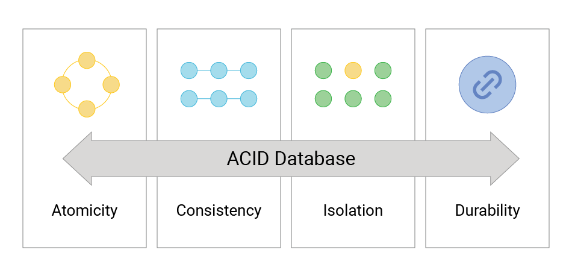

- ACID is an acronym for **Atomicity, Consistency, Isolation, and Durability**,which are four fundamental properties that guarantee reliable and predictable handling of database transactions.
- These properties are essential to ensure data integrity, especially in relational database systems.

1. **Atomicity**
    - This means a transaction is treated as a single, indivisible unit of work.
    - Either all the operations in the transaction are completed successfully, or none are.
    - If any part fails, the transaction is rolled back to the initial state, preventing partial updates.
    - For example, transferring money between accounts must debit one account and credit 
    another; both actions must succeed together or not at all
2. **Consistency**
    - Consistency ensures that a transaction brings the database from one valid state to another, maintaining all predefined rules, constraints, and data integrity.
    - If a transaction violates these rules, it is rolled back, leaving the database unchanged
3. **Isolation**
    - Isolation guarantees that concurrent transactions execute independently without interfering with each other.
    - The outcome should be as if transactions were executed serially, one after the other.
    - Different isolation levels control how transaction effects become visible to 
    others, balancing consistency and performance
4. **Durability**
    - Durability ensures that once a transaction is committed, its changes are permanent and survive system failures like crashes or power loss.
    - This is typically achieved through persistence mechanisms such as transaction logs and backups