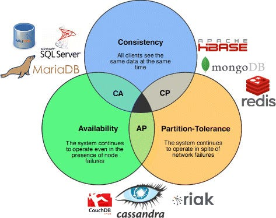

The **CAP Theorem** is a fundamental concept in distributed database systems. 

It explains the trade-offs faced when designing systems that store and manage data across multiple, networked computers.

- **Consistency:** Every read receives the most recent write or an error. All nodes in the system return the same data at any given time.
- **Availability:** Every request (read or write) receives a response, even if some nodes are down—there is no guarantee the response contains the latest data.
- **Partition Tolerance:** The system continues to operate despite arbitrary network partitions or communication failures between nodes.

## The CAP Trade-Off

According to the theorem, in the presence of a network partition (communication breakdown between nodes), a system can guarantee **at most two out of three** of these properties:

| Combination | Possible? | Meaning |
| --- | --- | --- |
| Consistency + Availability | Only if no partition | Data is always correct and requests always receive a response. |
| Consistency + Partition Tolerance | Yes | May reject requests to preserve consistency during a partition. |
| Availability + Partition Tolerance | Yes | System responds to all requests but may serve stale or inconsistent data. |
- In real-world distributed systems, **partition tolerance** is required (as network failures are inevitable). So, systems are forced to make trade-offs between *consistency* and *availability* during a partition.

## Examples

- **CP (Consistency + Partition Tolerance):**
    
    Prioritizes data correctness over availability during network failure. E.g., HBase, MongoDB (default).
    
- **AP (Availability + Partition Tolerance):**
    
    Prioritizes delivering a response, even if data may not be the latest. E.g., Cassandra, Couchbase.
    
- **CA (Consistency + Availability):**
    
    Only achievable in non-distributed, single-node systems or when there is no partition.